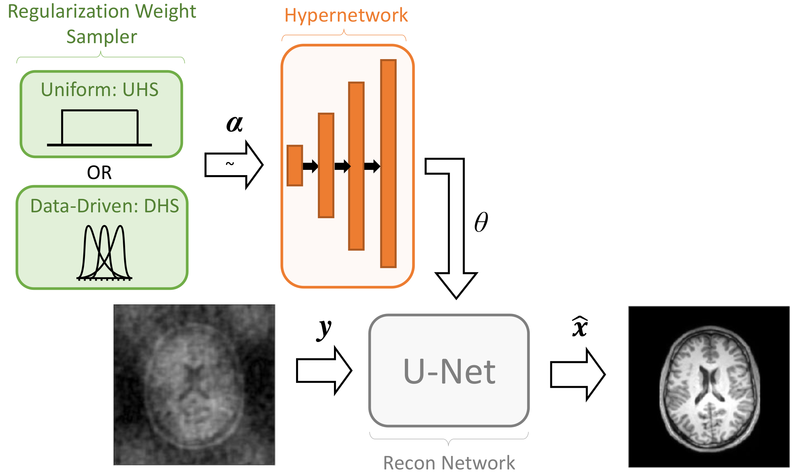

# Regularization-Agnostic Compressed Sensing MRI Reconstruction with Hypernetworks

## Abstract
Reconstructing under-sampled k-space measurements in Compressed Sensing MRI (CS-MRI) is classically solved with regularized least-squares. Recently, deep learning has been used to amortize this optimization by training reconstruction networks on a dataset of under-sampled measurements. 
Here, a crucial design choice is the regularization function(s) and corresponding weight(s). 
In this paper, we explore a novel strategy of using a hypernetwork to generate the parameters of a separate reconstruction network as a function of the regularization weight(s), resulting in a regularization-agnostic reconstruction model. 
At test time, for a given under-sampled image, our model can rapidly compute reconstructions with different amounts of regularization. We analyze the variability of these reconstructions, especially in situations when the overall quality (as measured by PSNR, for example) is similar. Finally, we propose and empirically demonstrate an efficient and data-driven way of maximizing reconstruction performance given limited hypernetwork capacity.

## Requirements
The code was tested on:
- python 3.7.5
- pytorch 1.3.1
- matplotlib 3.1.2
- numpy 1.17.4
- tqdm 4.41.1

## Usage
Before running, run `mkdir out/` to create default location for model checkpoints and losses.
### Uniform hyperparameter sampling, medium hypernetwork 

    python scripts/run.py -fp example --reg_types cap tv --bounds 0 1 0 1 --hyparch large --sampling uhs

### Data-driven hyperparameter sampling, large hypernetwork 

    python scripts/run.py -fp example --reg_types cap tv --bounds 0 1 0 1 --hyparch medium --sampling dhs --topK 8

## Contact
Feel free to open an issue in github for any problems or questions.
