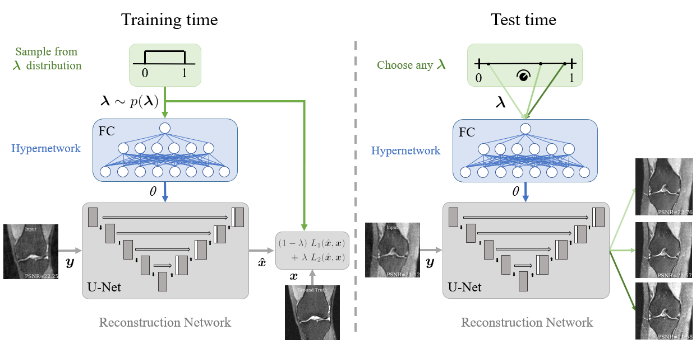

# HyperRecon: Computing Multiple Image Reconstructions with a Single Hypernetwork

# Instructions
## Requirements
This code was tested on:

- python 3.7.10
- pytorch 1.4.0
- numpy 1.19.2

Note that in recent versions of Pytorch (e.g. 1.10), the function `torch.fft()` has been deprecated and has been moved to `torch.fft.fft()`, as well as other changes (e.g. outputting complex types instead of 2-channel).
Additionally, we found that `BatchConv2d` runs nearly 2x slower in later versions of Pytorch.

## Data
As a minimally-working example, the code provides an `Arr` class which loads a numpy array for use in a dataset.
The paths to the train dataset and test dataset can be provided by the `train_path` and `test_path` flags. 
More sophisticated dataloaders can be integrated by changing the `get_dataloader` function in `util/train.py` accordingly.

## Training 
To run the code with default parameters, a bash script is provided:

    bash train.sh

This script assumes the data is of shape (256, 256) in order to match the shapes of provided under-sampling masks.

Here are some detailed options for each flag:

    python -u run.py \
      --models_dir out/
      --train_path /share/sablab/nfs02/users/aw847/data/knee/knee_train_normalized.npy \ 
      --test_path /share/sablab/nfs02/users/aw847/data/knee/knee_test_normalized.npy \ 
      --mask_path data/poisson_disk_8p3_256_256.npy
      -fp uhs_l1_ssim \
      --log_interval 25 \
      --image_dims 256 256 \
      --lr 0.001 \
      --batch_size 32 \
      --num_epochs 100 \
      --arch hyperunet \                    # Specifies architecture, can be one of [hyperunet or unet]
      --hnet_hdim 128 \                     # Specifies hypernetwork hidden dimension
      --unet_hdim 32 \                      # Specifies main Unet hidden channel dimension
      --forward_type csmri \                # Specifies forward model, can be one of [csmri, superresolution, denoising]
      --undersampling_rate $RATE \          # Specifies under-sampling rate of mask for CS-MRI
      --loss_list l1 ssim \                 # Specifies losses
      --method base_train \                 # Specifies training strategy, can be one of [base_train, dhs]
      --distribution uniform                # Specifies sampling distribution for hyperparameter, can be one of [uniform, uniform_oversample, constant]

# HyperRecon Papers
[link to paper](https://arxiv.org/abs/2101.02194)